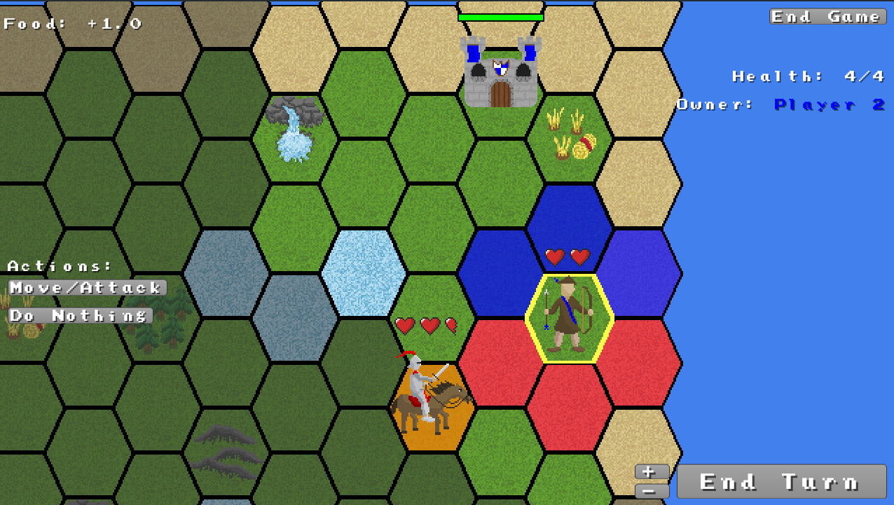

This is just a little strategy game I made for fun. I just wanted to test out hexagon mouse clicking but ended up making a game. There are no plans for any more updates.



This project falls under the MIT license, basically meaning you can do whatever you want with the code and assets, but credit should be given.

## Running the Game

1. Make sure you have JDK 8 installed, with JAVA_HOME pointing to it. NOTE: This project uses an older gradle version that does not support Java 9+

2. Then simply execute the gradle script

```
$ ./gradlew desktop:run
```

This game supports Android (tested working). There are also other platforms that can be targeted, but without guarantees of success.

## Downloading the Game

- Desktop (Java): [Download](http://hollowbit.net/vedi0boy/play/hexstrat/hexstrat.jar) (Warning: download starts immediately)
- Android: [Download App](https://play.google.com/store/apps/details?id=net.hollowbit.strategygame)

## License
MIT License

Copyright (c) 2016 Nathanael Maher

Permission is hereby granted, free of charge, to any person obtaining a copy
of this software and associated documentation files (the "Software"), to deal
in the Software without restriction, including without limitation the rights
to use, copy, modify, merge, publish, distribute, sublicense, and/or sell
copies of the Software, and to permit persons to whom the Software is
furnished to do so, subject to the following conditions:

The above copyright notice and this permission notice shall be included in all
copies or substantial portions of the Software.

THE SOFTWARE IS PROVIDED "AS IS", WITHOUT WARRANTY OF ANY KIND, EXPRESS OR
IMPLIED, INCLUDING BUT NOT LIMITED TO THE WARRANTIES OF MERCHANTABILITY,
FITNESS FOR A PARTICULAR PURPOSE AND NONINFRINGEMENT. IN NO EVENT SHALL THE
AUTHORS OR COPYRIGHT HOLDERS BE LIABLE FOR ANY CLAIM, DAMAGES OR OTHER
LIABILITY, WHETHER IN AN ACTION OF CONTRACT, TORT OR OTHERWISE, ARISING FROM,
OUT OF OR IN CONNECTION WITH THE SOFTWARE OR THE USE OR OTHER DEALINGS IN THE
SOFTWARE.
